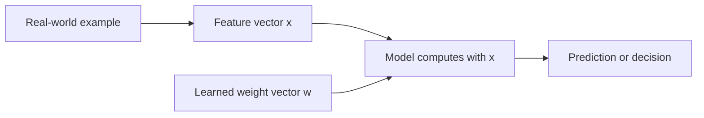
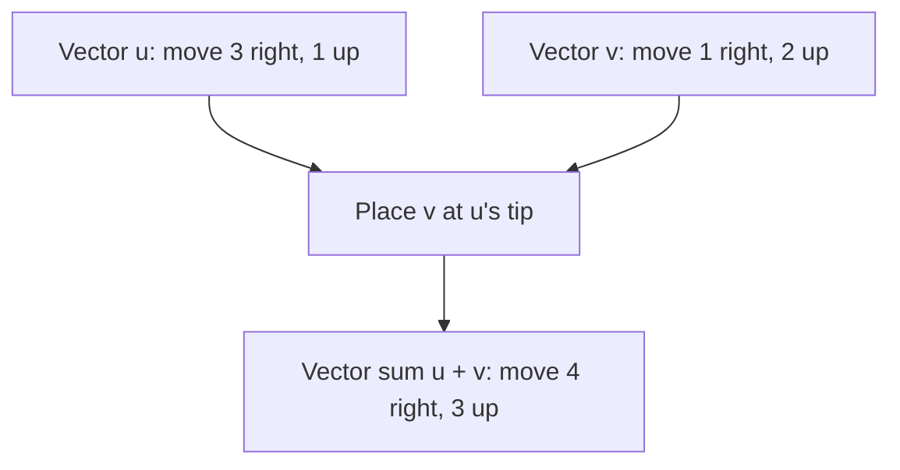
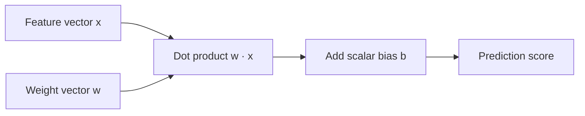

# Chapter 01 · Vectors

> A vector is an ordered collection of numbers. In machine learning, those numbers can describe an input, a model's parameters, a gradient, or a learned embedding.

## Introduction

Before a model can learn from a house, an image, or a sentence, we need a way to represent that thing as numbers. A **vector** is one of the simplest and most important representations.

For example, a small house-price dataset might describe one house with this vector:

\[
\mathbf{x} =
\begin{bmatrix}
1200 \\
3 \\
15
\end{bmatrix}
\]

The three entries could mean floor area in square feet, number of bedrooms, and age in years. The vector does not know what a house is; it simply keeps related measurements in a fixed order.

!!! abstract "Learning objectives"

    By the end of this chapter, you will be able to:

    - distinguish a scalar from a vector;
    - read vector components and dimensions;
    - add, subtract, and scale vectors;
    - calculate magnitude, a dot product, cosine similarity, and a projection;
    - normalize a non-zero vector;
    - explain where vectors appear in machine learning.

---

## 1. Motivation: why ML needs vectors

Computers need a consistent numerical representation before they can make predictions. A vector gives one observation a shape that algorithms can work with.

| Real-world object | Possible vector | Meaning of the components |
| --- | --- | --- |
| A 2D movement | \([3, -2]\) | 3 steps right, 2 steps down |
| An RGB colour | \([255, 128, 0]\) | red, green, blue intensity |
| A house | \([1200, 3, 15]\) | area, bedrooms, age |
| A word embedding | \([0.12, -0.44, \ldots]\) | learned numerical features |

The same idea appears again and again:



For a simple linear model, the core calculation is a dot product:

\[
\text{score} = \mathbf{w}^{\mathsf{T}}\mathbf{x} + b
\]

Do not worry if this equation looks unfamiliar. This chapter builds every vector idea that it uses.

---

## 2. Intuition: an arrow with components

A two-dimensional vector can be drawn as an arrow from the origin. The arrow below ends at \((3, 2)\), so its components are \([3, 2]\).

```text
y
^                         tip: (3, 2)
|                            •
|                          / |
|                        /   |
|                      /     |  2 up
|                    /       |
|                  /         |
+----------------------------+----> x
(0, 0)            3 right

v = [3, 2]
```

The arrow tells two stories at once:

- its **direction** tells us where it points;
- its **magnitude** (or length) tells us how far it reaches.

!!! note "A point is not quite the same as a vector"

    The point \((3, 2)\) identifies a location. The vector \([3, 2]\) describes a displacement: move 3 right and 2 up. We often draw a vector with its tail at the origin because it is convenient, but the same displacement can start anywhere.

### Scalars versus vectors

A **scalar** is one number: temperature \(28\), a learning rate \(0.01\), or a model bias \(b\).

A **vector** is an ordered list of numbers. We usually write it in bold:

\[
\mathbf{v} =
\begin{bmatrix}
v_1 \\
v_2 \\
\vdots \\
v_n
\end{bmatrix}
\in \mathbb{R}^{n}
\]

Here, \(n\) is the vector's **dimension**: a 2D vector has two components, while an embedding could have hundreds or thousands.

!!! warning "Order matters"

    \([1200, 3, 15]\) and \([3, 1200, 15]\) contain the same numbers but represent different data if the first position is supposed to be area. A vector is an **ordered** collection.

---

## 3. Core vector operations

### 3.1 Addition and subtraction

Vectors with the same dimension can be added component by component:

\[
\begin{bmatrix}a_1 \\ a_2\end{bmatrix}
+
\begin{bmatrix}b_1 \\ b_2\end{bmatrix}
=
\begin{bmatrix}a_1+b_1 \\ a_2+b_2\end{bmatrix}
\]

If you start at \((2, 1)\) and move by \([3, -2]\), your new position is:

\[
\begin{bmatrix}2 \\ 1\end{bmatrix}
+
\begin{bmatrix}3 \\ -2\end{bmatrix}
=
\begin{bmatrix}5 \\ -1\end{bmatrix}
\]

Subtraction reverses the question. To find the displacement from point \(A\) to point \(B\), subtract:

\[
\overrightarrow{AB} = \mathbf{B} - \mathbf{A}
\]

=== "By hand"

    ```text
    u = [3, 1]
    v = [1, 2]

    u + v = [3 + 1, 1 + 2] = [4, 3]
    u - v = [3 - 1, 1 - 2] = [2, -1]
    ```

=== "NumPy"

    ```python
    import numpy as np

    u = np.array([3.0, 1.0])
    v = np.array([1.0, 2.0])

    print(u + v)  # [4. 3.]
    print(u - v)  # [ 2. -1.]
    ```

### 3.2 Scalar multiplication

Multiplying a vector by one scalar stretches, shrinks, or reverses it:

\[
c\mathbf{v} =
c
\begin{bmatrix}v_1 \\ v_2\end{bmatrix}
=
\begin{bmatrix}cv_1 \\ cv_2\end{bmatrix}
\]

For \(\mathbf{v} = [3, 2]\):

- \(2\mathbf{v} = [6, 4]\) is twice as long and points in the same direction;
- \(0.5\mathbf{v} = [1.5, 1]\) is half as long;
- \(-\mathbf{v} = [-3, -2]\) has the same length but points the other way.

### 3.3 Magnitude: how long is a vector?

For a 2D vector, the Pythagorean theorem gives its length. A vector \([3, 4]\) forms a right triangle with horizontal side 3 and vertical side 4:

\[
\|\mathbf{v}\|_2
= \sqrt{3^2 + 4^2}
= \sqrt{9 + 16}
= 5
\]

For any \(n\)-dimensional vector, the Euclidean magnitude (also called the **L2 norm**) is:

\[
\|\mathbf{v}\|_2 = \sqrt{\sum_{i=1}^{n} v_i^2}
\]

The subscript 2 names the L2 norm. Later, you will meet other ways of measuring vector size, but this is the default geometric distance.

### 3.4 Normalization: keep direction, make length one

A **unit vector** has magnitude 1. We create one by dividing each component by the vector's magnitude:

\[
\hat{\mathbf{v}} = \frac{\mathbf{v}}{\|\mathbf{v}\|_2}
\]

For \([3, 4]\), the magnitude is 5, so:

\[
\hat{\mathbf{v}} = \left[\frac{3}{5}, \frac{4}{5}\right] = [0.6, 0.8]
\]

!!! danger "Never normalize the zero vector"

    The zero vector \([0, 0, \ldots, 0]\) has magnitude zero and no direction. Dividing by zero is undefined, so good code should raise a clear error instead of silently producing invalid values.

### 3.5 Dot product: turn two vectors into one number

The **dot product** multiplies matching components and adds the results:

\[
\mathbf{a} \cdot \mathbf{b}
= \sum_{i=1}^{n} a_i b_i
\]

For \(\mathbf{a} = [1, 2, 3]\) and \(\mathbf{b} = [4, -5, 6]\):

\[
\mathbf{a} \cdot \mathbf{b}
= (1)(4) + (2)(-5) + (3)(6)
= 4 - 10 + 18
= 12
\]

Geometrically, the dot product also tells us how much two vectors point in the same direction:

\[
\mathbf{a} \cdot \mathbf{b}
= \|\mathbf{a}\|_2\|\mathbf{b}\|_2\cos\theta
\]

| Angle between vectors | \(\cos\theta\) | Interpretation |
| --- | --- | --- |
| \(0^\circ\) | 1 | Same direction |
| \(90^\circ\) | 0 | Perpendicular (orthogonal) |
| \(180^\circ\) | -1 | Opposite directions |

!!! warning "`*` is not the dot product in NumPy"

    `u * v` multiplies components one at a time. For a dot product, use `u @ v` or `np.dot(u, v)`.

    ```python
    u = np.array([1.0, 2.0])
    v = np.array([3.0, 4.0])

    u * v       # array([3., 8.])  element-wise multiplication
    u @ v       # 11.0             dot product
    ```

### 3.6 Cosine similarity: compare direction fairly

A raw dot product gets larger when vectors get longer. **Cosine similarity** removes that length effect by dividing by both magnitudes:

\[
\operatorname{cosine\_similarity}(\mathbf{a}, \mathbf{b})
= \frac{\mathbf{a} \cdot \mathbf{b}}
{\|\mathbf{a}\|_2\|\mathbf{b}\|_2}
\]

It ranges from -1 to 1. This is useful when the direction encodes meaning, such as comparing normalised word or image embeddings.

### 3.7 Projection: the part pointing along another direction

The projection of \(\mathbf{a}\) onto a non-zero vector \(\mathbf{b}\) keeps only the part of \(\mathbf{a}\) that points along \(\mathbf{b}\):

\[
\operatorname{proj}_{\mathbf{b}}(\mathbf{a})
= \frac{\mathbf{a} \cdot \mathbf{b}}
{\mathbf{b} \cdot \mathbf{b}}\mathbf{b}
\]

For example, projecting \([3, 1]\) onto the horizontal vector \([1, 0]\) gives \([3, 0]\). The upward component is discarded because it does not point along the basis direction.

---

## 4. Visualising vector addition

To add vectors geometrically, place the tail of the second arrow at the tip of the first. The sum points from the original tail to the final tip.


The image is generated by the Matplotlib helper in `src/ml_from_scratch/linear_algebra/visualizations.py`:

```powershell
python -m ml_from_scratch.linear_algebra.visualizations
```

It uses the same tested vector operations as the rest of the chapter.



---

## 5. Worked examples

### Example 1: a movement vector

You are at \((2, 1)\). A movement command says \([3, -2]\): 3 right and 2 down.

\[
\begin{bmatrix}2 \\ 1\end{bmatrix}
+
\begin{bmatrix}3 \\ -2\end{bmatrix}
=
\begin{bmatrix}5 \\ -1\end{bmatrix}
\]

Your new position is \((5, -1)\).

### Example 2: a direction with a standard length

Suppose a game character needs to move in the direction \([3, 4]\), but always at unit speed. Its magnitude is 5, so the direction vector is:

\[
\left[\frac{3}{5}, \frac{4}{5}\right] = [0.6, 0.8]
\]

After normalisation, the direction is unchanged while the length becomes 1.

### Example 3: a tiny similarity calculation

Let two toy embeddings be \(\mathbf{a} = [1, 2]\) and \(\mathbf{b} = [2, 4]\). They point in exactly the same direction, although \(\mathbf{b}\) is longer.

\[
\mathbf{a} \cdot \mathbf{b} = (1)(2) + (2)(4) = 10
\]

Their cosine similarity is 1 because their angle is \(0^\circ\). Normalisation lets us express that directional agreement without letting length dominate the comparison.

### Example 4: a projection

Project \(\mathbf{a} = [3, 1]\) onto \(\mathbf{b} = [1, 0]\):

\[
\operatorname{proj}_{\mathbf{b}}(\mathbf{a})
= \frac{[3, 1] \cdot [1, 0]}{[1, 0] \cdot [1, 0]}[1, 0]
= \frac{3}{1}[1, 0]
= [3, 0]
\]

---

## 6. Python implementation

The chapter's implementation lives at:

```text
src/ml_from_scratch/linear_algebra/vectors.py
```

It validates that vectors are numeric, finite, one-dimensional, and compatible before doing arithmetic. Here is a typical use:

```python
from ml_from_scratch.linear_algebra.vectors import (
    add,
    cosine_similarity,
    magnitude,
    normalize,
    project_onto,
)

u = [3, 1]
v = [1, 2]

print(add(u, v))                     # [4. 3.]
print(magnitude([3, 4]))              # 5.0
print(normalize([3, 4]))              # [0.6 0.8]
print(cosine_similarity([1, 1], [2, 2]))  # 1.0
print(project_onto([3, 1], [1, 0]))   # [3. 0.]
```

Run the unit tests from the repository root:

```powershell
pytest
```

For an interactive walkthrough, open:

```text
notebooks/module_01_linear_algebra/01_vectors.ipynb
```

### API reference

::: ml_from_scratch.linear_algebra.vectors

---

## 7. Where vectors appear in ML

| ML concept | Vector role |
| --- | --- |
| Input features | One row of measurements becomes \(\mathbf{x}\) |
| Model parameters | Linear-model weights become \(\mathbf{w}\) |
| Gradients | One derivative per parameter forms \(\nabla L\) |
| Embeddings | A learned vector represents a word, image, user, or item |
| Recommendation and retrieval | Dot products or cosine similarity compare embeddings |
| Computer vision | Pixel values, image patches, and latent features are vectors |

The route from a vector to an ML prediction often looks like this:



---

## 8. Common mistakes

1. **Adding incompatible dimensions.** You can add \([1, 2]\) and \([3, 4]\), but not \([1, 2]\) and \([3, 4, 5]\).
2. **Confusing components with magnitude.** The vector \([3, 4]\) is not "length 3 and length 4"; its total length is 5.
3. **Using `*` for a dot product in NumPy.** Use `@` or `np.dot` instead.
4. **Normalising the zero vector.** It has no direction and causes division by zero.
5. **Forgetting feature order.** Swapping columns changes the meaning of an ML input vector.
6. **Treating a high dot product as pure similarity.** A long vector can have a high dot product even when direction is not a close match; use cosine similarity when direction is what matters.

---

## 9. Exercises

Try these without NumPy first. Open an answer only after you have written down your reasoning.

??? question "1. Add and subtract `[4, -1]` and `[-2, 3]`."

    \[
    [4, -1] + [-2, 3] = [2, 2]
    \]

    \[
    [4, -1] - [-2, 3] = [6, -4]
    \]

??? question "2. What is the magnitude of `[6, 8]`?"

    \[
    \sqrt{6^2 + 8^2} = \sqrt{36 + 64} = 10
    \]

??? question "3. Normalize `[5, 12]`."

    Its magnitude is \(\sqrt{25 + 144} = 13\). The unit vector is:

    \[
    \left[\frac{5}{13}, \frac{12}{13}\right]
    \]

??? question "4. Calculate the dot product of `[2, -1, 3]` and `[4, 5, -2]`."

    \[
    (2)(4) + (-1)(5) + (3)(-2) = 8 - 5 - 6 = -3
    \]

??? question "5. Why cannot `[1, 2]` be added to `[1, 2, 3]`?"

    Vector addition needs a matching component in each position. The first vector has no third component, so the operation has no well-defined result.

??? question "6. Give one ML example where a vector is useful."

    One answer: a house-price model can represent a house as `[area, bedrooms, age]`. The model can then multiply that feature vector by a learned weight vector.

---

## 10. Interview questions

??? question "What is the difference between a scalar and a vector?"

    A scalar is one number. A vector is an ordered collection of numbers, often used to represent multiple related measurements, a direction, or learned features.

??? question "What does a dot product measure?"

    Algebraically, it multiplies matching components and sums them. Geometrically, it combines the vectors' magnitudes with how closely their directions align. It is fundamental to linear models and attention mechanisms.

??? question "Why normalize embeddings?"

    Normalisation makes every embedding have the same length, so comparisons such as cosine similarity focus on direction (often semantic relationship) rather than scale.

??? question "What happens when two vectors are orthogonal?"

    They are perpendicular, their angle is \(90^\circ\), and their dot product is zero (assuming standard Euclidean geometry).

??? question "What is the difference between element-wise multiplication and a dot product?"

    Element-wise multiplication returns a vector: `[1, 2] * [3, 4] = [3, 8]`. A dot product sums those products and returns one scalar: `1·3 + 2·4 = 11`.

---

## 11. References

- Deisenroth, Faisal, and Ong, [*Mathematics for Machine Learning*](https://mml-book.github.io/).
- Gilbert Strang, [*Introduction to Linear Algebra*](https://math.mit.edu/~gs/linearalgebra/).
- NumPy, [Linear algebra documentation](https://numpy.org/doc/stable/reference/routines.linalg.html).

## 12. Summary

- A vector is an ordered list of numeric components.
- Vectors can represent position, movement, ML features, parameters, gradients, and embeddings.
- Addition and scalar multiplication combine or scale vectors component by component.
- Magnitude measures length; normalisation gives a unit-length direction.
- Dot products and cosine similarity quantify alignment.
- Projections keep the component of one vector along another direction.

!!! success "Progress update"

    You have completed the first building block of Linear Algebra. Next, matrices will let us collect many vectors and transform them together.

<div class="chapter-navigation" markdown>

[← Module 01 overview](index.md){ .md-button }
<span class="disabled">Next: Chapter 02 · Matrices (coming soon)</span>

</div>
